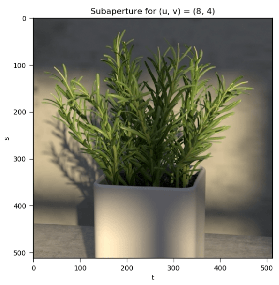
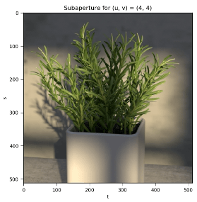
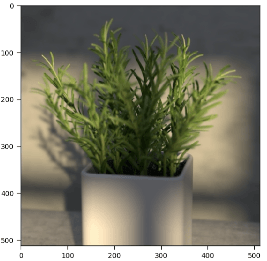
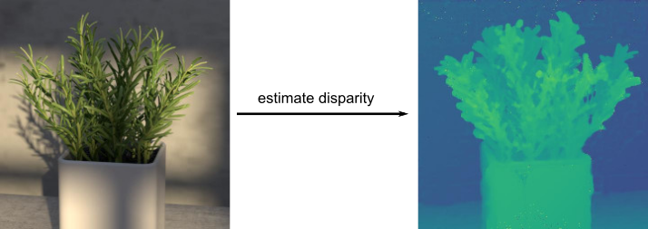
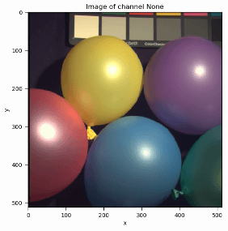
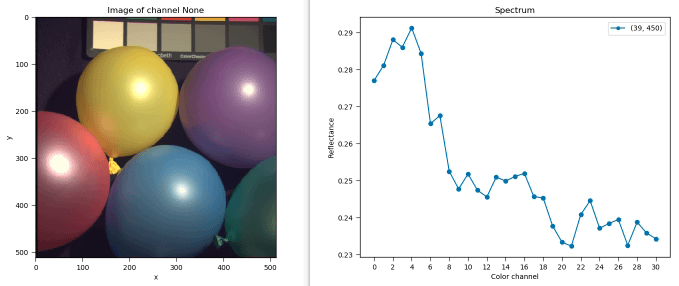

******************
User Documentation
******************

Introduction
============
Plenpy is a Python library to work with light fields (monochromatic, RGB or
multispectral) as well as regular multi- or hyperspectral image data.
Some common tools, such as versatile plot functions for light fields and
hyperspectral data, various disparity estimation algorithms, and spectrum to
color conversion, are also provided.

Furthermore, plenpy provides the possibility and a common interface
to calibrate and decode light fields (or hyperspectral images) from
computational cameras such as the Lytro light field cameras,
for which we provide a reference implementation.

This library is not build to be neither very light-weight nor exhaustive
but to support easy exploration, research and development workflows.
It started with a research project and the lack of a proper and modular Python
implementation to deal with light fields in general and with coded light fields
as given by a light field camera in particular, and grew with time.
If you feel like there are important features missing, or that the
API or the backend is terrible, please contribute via the
`GitLab repository <https://gitlab.com/iiit-public/plenpy>`_!
Support is always welcome.

How To Use
==========

There are mainly three important modules to plenpy which we will discuss separately:

* The :mod:`plenpy.lightfields` module, providing the
  :class:`~plenpy.lightfields.LightField` class

* The :mod:`plenpy.spectral` module, providing the
  :class:`~plenpy.spectral.SpectralImage` class

* The :ref:`cameras<plenpy.cameras package>`  package, containing various
  camera modules and classes, such as the
  :class:`~plenpy.cameras.lytro_illum.LytroIllum` camera class.

Light fields
------------

General
^^^^^^^

In plenpy, light fields are represented as an instance of the
:class:`~plenpy.lightfields.LightField` class which is basically
just an extension of a Numpy :class:`numpy.ndarray` with a fixed shape.
That is, all light fields are of shape ``(u, v, s, t, ch)``, where
``(u, v)`` corresponds to the angular component of the light field,
``(s, t)`` to the spatial and ``ch`` to the spectral.
For example, the shape ``(9, 9, 512, 512, 1)`` corresponds to a monochromatic light field
, ``(9, 9, 512, 512, 3)`` to an RGB light field, and ``(9, 9, 512, 512, 30)``
to a multispectral light field.
Throughout plenpy, the color/spectral channel is always the last axis.

As the most straightforward way, a :class:`~plenpy.lightfields.LightField`
can be initialized using a Numpy array of the same shape, that is for example:

.. runblock:: pycon

    >>> import plenpy.logg as lg  # ignore
    >>> lg.disable()  # ignore
    >>> import numpy as np
    >>> from plenpy.lightfields import LightField
    >>> u, v, s, t, ch = 9, 9, 512, 512, 10
    >>> tmp_array = np.random.rand(u, v, s, t, ch)
    >>> tmp_array = np.random.rand(u, v, s, t, ch).astype(np.float32)  # ignore
    >>> lf = LightField(tmp_array)
    >>> lf.shape

Note, that by default, all light fields in plenpy are represented by float
values and should be valued between 0 and 1.
This ensures that all processing, such as disparity estimation, works as intended.
If you pass a ``uint8`` oder ``uint16`` array, the data will automatically be converted
to a float ranged in :math:`[0, 1]`. E.g.:

.. runblock:: pycon

    >>> import numpy as np  # ignore
    >>> import plenpy.logg as lg  # ignore
    >>> lg.disable()  # ignore
    >>> from plenpy.lightfields import LightField  # ignore
    >>> u, v, s, t, ch = 9, 9, 512, 512, 10  # ignore
    >>> tmp_array = (255*np.random.rand(u, v, s, t, ch)).astype(np.uint8)
    >>> lf = LightField(tmp_array)
    >>> lf.dtype, lf.min(), lf.max()

By default, the datatype upon construction is ``float32`` as light fields
can reach a significant size. However, you can specify either one of
``float16``, ``float32`` or ``float64`` when creating a light field instance,
just like is the case with Numpy arrays:

.. runblock:: pycon

    >>> import numpy as np  # ignore
    >>> import plenpy.logg as lg  # ignore
    >>> lg.disable()  # ignore
    >>> from plenpy.lightfields import LightField  # ignore
    >>> u, v, s, t, ch = 9, 9, 512, 512, 10  # ignore
    >>> tmp_array = np.random.rand(u, v, s, t, ch)
    >>> lf = LightField(tmp_array, dtype=np.float64)
    >>> lf.dtype

In most ways, an instance of a :class:`~plenpy.lightfields.LightField` behaves
just like a Numpy array, that is you can perform scalar multiplication,
addition, substraction and in particular indexing, e.g. to extract sub light
fields or subaperture views:

.. runblock:: pycon

    >>> import numpy as np  # ignore
    >>> import plenpy.logg as lg  # ignore
    >>> lg.disable()  # ignore
    >>> from plenpy.lightfields import LightField  # ignore
    >>> u, v, s, t, ch = 9, 9, 512, 512, 10  # ignore
    >>> tmp_array = np.random.rand(u, v, s, t, ch)
    >>> tmp_array = np.random.rand(u, v, s, t, ch).astype(np.float32)  # ignore
    >>> lf = LightField(tmp_array)
    >>> lf_crop = lf[3:5, 2:8, 128:256, 128:256]
    >>> lf_crop.shape
    >>> central_view = lf[4, 4]
    >>> central_view.shape

Since the :class:`~plenpy.lightfields.LightField` class is derived from the
Numpy :class:`numpy.ndarray` class, you can furthermore use everything that is
available for Numpy arrays on light fields, such as ``max()``, ``min()``,
``mean()``, ``clip()``, etc. Also, if necessary, you can always convert
a :class:`~plenpy.lightfields.LightField` instance back to a Numpy array using
Numpy's :func:`numpy.asarray()`:

.. runblock:: pycon

    >>> import numpy as np  # ignore
    >>> import plenpy.logg as lg  # ignore
    >>> lg.disable()  # ignore
    >>> from plenpy.lightfields import LightField  # ignore
    >>> u, v, s, t, ch = 9, 9, 512, 512, 10  # ignore
    >>> tmp_array = np.random.rand(u, v, s, t, ch).astype(np.float32)  # ignore
    >>> lf = LightField(tmp_array)
    >>> type(lf)
    >>> lf = np.asarray(lf)
    >>> type(lf)

Reading/loading light fields
^^^^^^^^^^^^^^^^^^^^^^^^^^^^
Of course, often times light field data is not available as an array directly,
but as a series of images, a 2D representation of the light field or even
as a coded image for example taken with a plenoptic camera such as the
Lytro Illum camera. For this, we provide several classmethods.

All image reading is handled using :func:`imageio.imread()` and
you can always pass a ``format`` option to the class methods to specify which
plugin is used for reading the image.
Usually, not passing the option, the format is automatically chosen by Imageio.
All metadata that is extracted by Imageio is contained in the
:class:`~plenpy.lightfields.LightField`'s ``meta`` attribute.

From a collection of subaperture views
""""""""""""""""""""""""""""""""""""""

Commonly, light fields are saved subaperture-wise, that is, for every angular
view :math:`(u, v)` the 2D color subaperture view
:math:`I_{uv}(s, t, ch) = L(u, v, s, t, ch)` is saved.
For example, the `Stanford Light Field Archive <http://lightfield.stanford.edu>`_
or the `HCI Light Field Dataset <https://lightfield-analysis.uni-konstanz.de/>`_
are of this form.

To read from a series of subaperture views, make sure that all subaperture views
are contained within a single folder (which may not contain any other image data).
Then use the :func:`~plenpy.lightfields.LightField.from_file_collection()`
classmethod passing the number of subaperture views per dimension::

    from plenpy.lightfields import LightField
    lf = LightField.from_file_collection("<path-to-folder>", 9)

reads a light field with angular resolution (9, 9) and::

    from plenpy.lightfields import LightField
    lf = LightField.from_file_collection("<path-to-folder>", 13, 11)

reads a light field with angular resolution (13, 11).
By default, the subaperture views are read in alphanumerical order with
v iterating first, then u. If you find this to give you a flipped light field,
use the ``invert`` option. For details, see the documentaion of
:func:`~plenpy.lightfields.LightField.from_file_collection()`.

From a single 2D representation file
""""""""""""""""""""""""""""""""""""

Light fields can also be saved as a 2D image by reshaping the light field
data to 2D, either in the so-called subaperture image (SAI) or
microlens image (MLI) view. That is, performing the reshape
:math:`(u, v, s, t, ch) \to (u\cdot s, v\cdot t, ch)` or
:math:`(u, v, s, t, ch) \to (s\cdot u, v\cdot t, ch)`.
For this, use the
:func:`~plenpy.lightfields.LightField.from_file()`
classmethod, for example::

    from plenpy.lightfields import LightField
    lf = LightField.from_file("<path-to-file>", 512, 256, method='sai')

to read a light field with spatial resolution of :math:`(512, 256)`.

From an already loaded image
""""""""""""""""""""""""""""
If you have already loaded a 2D representation of the light field by any means,
you can convert it to a light field using the
:func:`~plenpy.lightfields.LightField.from_img_data()` class method.

From a MATLAB .mat file
"""""""""""""""""""""""
Often, datasets provide light fields in MATLAB's ``.mat`` file format,
for example when decoded from a lenselet image using the
`MATLAB Light Field Toolbox <https://dgd.vision/Tools/LFToolbox/>`_.
Those ``.mat`` files contain the binary data labeled by keys (similar to
a Python dictionary), and the light field data might not correspond to the
shape convention used here. Therefore, the
:func:`~plenpy.lightfields.LightField.from_mat_file()` classmethod
provides the optional ``key`` and ``transpose`` options.

For example, if the ``.mat`` file contains the light field data
using the key ``lfdata`` in shape ``(ch, u, v, s, t)``, load the light field as::

    from plenpy.lightfields import LightField
    lf = LightField.from_mat_file("<path-to-file>", key="lfdata", transpose=(12340))

or if the shape of the ``.mat`` data is ``(s, t, u, v, ch)`` use
``transpose=(23014)``.

If the ``.mat`` file only contains a single key, it will be detected
automatically.

Writing/saving light fields
^^^^^^^^^^^^^^^^^^^^^^^^^^^
As a :class:`~plenpy.lightfields.LightField` instance is basically a Numpy array,
you can use Numpy's :func:`numpy.save()` function to save the light field
as binary data. You can then load the data using Numpy's :func:`numpy.load()`
and instantiate the light field from the array data directly (see above).

If you want to save the light field as a 2D image file, use the
:class:`~plenpy.lightfields.LightField`'s
:func:`~plenpy.lightfields.LightField.save()` method. If the light field
contains more than three color channels, every color channel is saved separately,
otherwise an RGB image is saved.
If you want to save a multispectral light field as RGB, use
:func:`~plenpy.lightfields.LightField.save_rgb()` instead.

Visualizing light fields
^^^^^^^^^^^^^^^^^^^^^^^^
Plenpy uses Matplotlib for all its visualization.
In the following examples, we will use the *Rosemary* light field from
the `HCI Light Field Dataset <https://lightfield-analysis.uni-konstanz.de/>`_.

There are many ways to visualize/plot a light field. As the most intuative
way, we provide a interactive visualization that lets you pan through the
different subaperture views and color channels.
For this, use the :func:`~plenpy.lightfields.LightField.show()` method.

This will plot the central subaperture view of the light field. If the light
field is multispectral, it will show a RGB representation of it.
**Click, hold and drag** with your mouse to pan through the different subaperture
views. Use the **right mouse click** to reset to the central view::

    from plenpy.lightfields import LightField
    lf = LightField.from_file_collection("<path-to-rosemary-folder>", 9)
    lf.show()

**Click your mouse wheel** to scroll through the color channels.
This is particularly useful for multispectral light fields.
The color channels will be colored in red, green, blue for RGB images
and in a color approximation for multispectral light fields.
Click the mouse wheel again, to go back to the regular view.

Furthermore, **double-clicking** into the subaperture view will plot the
color or **spectrum of that pixel**. Double-clicking another pixel, will plot
the spectra side-by-side. Again, this is mostly useful for
multi- or hyperspectral light fields.

Also, you can directly plot the light field's disparity map (see below),
using :func:`~plenpy.lightfields.LightField.show_disparity()`.

Using the light field's disparity map, a light field can be refocused to
an arbitrary focal plane. We provide an interactive **refocus visualizer**,
which is ideal to introduce people to the possible applications of light fields.
Use :func:`~plenpy.lightfields.LightField.show_refocus_interactive()`
and click in the image to where you want your focus to be.
Press Enter, to show an all-in-focus image::

    from plenpy.lightfields import LightField
    lf = LightField.from_file_collection("<path-to-rosemary-folder>", 9)
    lf.show_refocus_interactive()

Of course, you can also simply plot a single subaperture, using
:func:`~plenpy.lightfields.LightField.show_subaperture()` or by extracting
the subaperture via indexing and plotting it with your favorite plotting tool.

Or, plot a 2D representation of the light field, either in the SAI or MLI
reshape (see above). Use
:func:`~plenpy.lightfields.LightField.show_2d()` and specify the according
``method`` option.

Disparity estimation
^^^^^^^^^^^^^^^^^^^^
On of the key applications of light fields is the calculation of a disparity
map from it. We have implemented some standard disparity estimation algorithms
from the literature as well as some confidence-based fusion methods.
They are commonly accessible using the wrapper
:func:`~plenpy.lightfields.LightField.get_disparity()`. See the documentation
for a detailed explonation. Feel free to add your own!

As a standard example, using the Structure Tensor to estimate slopes from
2.5D EPIs of the light field and fusing the disparity estimations and confidences
using the TV-L1 fusion method, use::

    lf = LightField.from_file('<path>', size)
    disp, conf = lf.get_disparity(method='structure_tensor', fusion_method='tv_l1', epi_method='2.5d')

Multi- or hyperspectral light fields
^^^^^^^^^^^^^^^^^^^^^^^^^^^^^^^^^^^^
Additional to the above light field processing possibilities, some
spectrum specific methods and options are available. Please see below, how
to deal with multi- or hyperspectral images in Plenpy. Most (if not all)
functionality mentioned there is also available for the
:class:`~plenpy.lightfields.LightField` class.

Convenience functions
^^^^^^^^^^^^^^^^^^^^^
There are some class methods that implement convenient functionality.
For example:

2D Light field representations
""""""""""""""""""""""""""""""
To get a number of different 2D representations of the light field, for example
a subaperture (SAI) or microlensimage (MAI) representation,
possibly with an hexagonal microlens arrangement, use
:func:`~plenpy.lightfields.LightField.get_2d()`.

Light field rescaling and resizing
""""""""""""""""""""""""""""""""""
When spatially rescaling or spatio-angular resizing the light field, use
:func:`~plenpy.lightfields.LightField.get_rescaled()` and
:func:`~plenpy.lightfields.LightField.get_resized()`, respectively.
These implementations are a little to a lot more performant than
rescaling the full 5D array. To rescale or resize the spectral axis of the
light field, use
:func:`~plenpy.lightfields.LightField.get_decimated_spectrum()`,
:func:`~plenpy.lightfields.LightField.get_resampled_spectrum()`, or
:func:`~plenpy.utilities.core.SpectralArray.get_grey()`.

Apertures
"""""""""
Use :func:`~plenpy.lightfields.LightField.apply_aperture()` to apply
an aperture in the angular domain of the light field.

EPI and EPI volumes
"""""""""""""""""""
There Are several EPI-related methods. For example, use
:func:`~plenpy.lightfields.LightField.get_epi()`  to get a "regular"
EPI of the light field, or
:func:`~plenpy.lightfields.LightField.get_2_5d_epi()` to obtain the 2.5D EPI.
Furthermore, we provide an EPI and EPI volume generator which makes it easy to
iterate over all EPIs or EPI volumes of a light field:
:func:`~plenpy.lightfields.LightField.epi_generator()`
:func:`~plenpy.lightfields.LightField.epi_volume_generator()`

All-in-focus and refocus
""""""""""""""""""""""""
To refocus the light field or get an all-in-focus light field, use
:func:`~plenpy.lightfields.LightField.get_refocus()` and
:func:`~plenpy.lightfields.LightField.get_all_in_focus()`, respectively.

Color-coding light fields
"""""""""""""""""""""""""
To apply a color-coded or spectrally-coded mask to the light field, use
:func:`~plenpy.lightfields.LightField.get_colorcoded_copy()`.

Multi- or hyperspectral images
------------------------------

General
^^^^^^^
Just as Plenpy's :class:`~plenpy.lightfields.LightField` class,
the provided :class:`~plenpy.spectral.SpectralImage` class behaves mostly
like a Numpy array with fixed shape ``(x, y, ch)``. Here,
``(x, y)`` corresponds to the spatial resolution of the image and
``ch`` to the number of spectral channels. In the following, we refer
to both multi- and hyperspectral images simply by *spectral image* as the
number of available spectral channels is arbitrary.

An instance of :class:`~plenpy.spectral.SpectralImage` can most
easily be created using the corresponding data as a Numpy array:

.. runblock:: pycon

    >>> import plenpy.logg as lg  # ignore
    >>> lg.disable()  # ignore
    >>> import numpy as np
    >>> from plenpy.spectral import SpectralImage
    >>> x, y, ch = 128, 256, 81
    >>> tmp_array = np.random.rand(x, y, ch)
    >>> tmp_array = np.random.rand(x, y, ch).astype(np.float32)  # ignore
    >>> si = SpectralImage(tmp_array)
    >>> si.shape
    >>> si.num_channels

Note, that by default, all spectral images in plenpy are represented by float
values and should be valued between 0 and 1.
This ensures that all processing works as intended.
If you pass a ``uint8`` oder ``uint16`` array, the data will automatically be converted
to a float ranged in :math:`[0, 1]`.

By default, the datatype upon construction is ``float32`` as the image data
can reach a significant size. However, you can specify either one of
``float16``, ``float32`` or ``float64`` when creating a spectral image instance,
just like is the case with Numpy arrays:

.. runblock:: pycon

    >>> import numpy as np  # ignore
    >>> import plenpy.logg as lg  # ignore
    >>> lg.disable()  # ignore
    >>> from plenpy.spectral import SpectralImage  # ignore
    >>> x, y, ch = 128, 256, 81  # ignore
    >>> tmp_array = np.random.rand(x, y, ch)
    >>> si = SpectralImage(tmp_array, dtype=np.float64)
    >>> si.dtype

In most ways, an instance of a :class:`~plenpy.spectral.SpectralImage` behaves
just like a Numpy array, that is you can perform scalar multiplication,
addition, substraction and in particular indexing, e.g. to extract line
or pixel spectra. Note that, due to the spectral metadata, extracing
spectral subbands via indexing is discouraged. Instead,
use the provided func:`~plenpy.spectral.SpectralImage.get_subband()`
method (see below for details).

Spectral band information
^^^^^^^^^^^^^^^^^^^^^^^^^
Additional to the image data, a :class:`~plenpy.spectral.SpectralImage`
instance carries meta information that is necessary for some spectral
computation. All meta information regarding the spectrum of the image
is contained in the image's
``bandInfo`` attribute. All other meta information may be collected using
the ``meta`` attribute with an arbitrary dictionary structure.

The ``bandInfo`` attribute is an instance of the
:class:`~plenpy.utilities.core.BandInfo` class containing information on:
    * the number of spectral samples
    * the wavelength centers of each spectral channel
    * the wavelength bandwiths
    * the wavelength center's standard deviations
    * the wavelength bandwith's standard deviation
    * the wavelength unit(s)

The band information has the be either created manually, most easily
using the  :func:`~plenpy.utilities.core.BandInfo.from_equidistant()`
classmethod, or is extracted automatically when the spectral image is
being read from an appropriate image format, such as ENVI (see below).

Reading/loading spectral images
^^^^^^^^^^^^^^^^^^^^^^^^^^^^^^^

From a collection of channel images
"""""""""""""""""""""""""""""""""""

Often, spectral images are saved channel-wise, that is, every spectral channel
is saved as a monocrhomatic, 2D image.
For example, `Columbia's CAVE Dataset <http://www.cs.columbia.edu/CAVE/databases/multispectral/>`_
is provided in this form.

To read from a series of monochromatic images, make sure that they are all
contained within a single folder (which may not contain any other image data).
Then use the :func:`~plenpy.spectral.SpectralImage.from_file_collection()`
classmethod::

    from plenpy.spectral import SpectralImage
    si = SpectralImage.from_file_collection("<path-to-folder>")

The channel images are read in alphanumerical order.
For details, see the documentaion of
:func:`~plenpy.spectral.SpectralImage.from_file_collection()`.

From a spectral image file
""""""""""""""""""""""""""

Spectral images can also be stored in a 3D file format, such as ENVI,
containing the image data and spectral metadata. You can load these
spectral images using the
:func:`~plenpy.spectral.SpectralImage.from_file()` classmethod.
To specify a format explicitely, use the ``format`` option.
The read from ENVI files, including the proper initialization of the
``BandInfo`` object from the file's metadata, use ``format='envi'``.
When reading ENVI files, use the path to the binary image data, not
the ENVI header file::

    from plenpy.spectral import SpectralImage
    si = SpectralImage.from_file("<path-to-img-file>", format='envi')

Reading 3D image data may require additional libraries to be installed,
or example ENVI requires the GDAL library. In either case, Imageio should raise an
appropriate warning or error.

From a MATLAB .mat file
"""""""""""""""""""""""
Often, datasets provide spectral images in MATLAB's ``.mat`` file format.
Those ``.mat`` files contain the binary data labeled by keys (similar to
a Python dictionary), and the image data might not correspond to the
shape convention used here. Therefore, the
:func:`~plenpy.spectral.SpectralImage.from_mat_file()` classmethod
provides the optional ``key`` and ``transpose`` options.

For example, if the ``.mat`` file contains the spectral image data
using the key ``reflectance`` in shape ``(ch, x, y)``, load the image as::

    from plenpy.spectral import SpectralImage
    lf = SpectralImage.from_mat_file("<path-to-file>", key="reflectance", transpose=(120))

or if the shape of the ``.mat`` data is ``(x, y, ch)``, you do not need
to pass the ``transpose`` option.

If the ``.mat`` file only contains a single key, it will be detected
automatically.

Writing/saving spectral images
^^^^^^^^^^^^^^^^^^^^^^^^^^^^^^
As a :class:`~plenpy.spectral.SpectralImage` instance is basically a Numpy array,
you can use Numpy's :func:`numpy.save()` function to save the image
as binary data. You can then load the data using Numpy's :func:`numpy.load()`
and instantiate the spectral image from the array data directly (see above).

If you want to save the spectral image channel-wise, use the
:class:`~plenpy.spectral.SpectralImage`'s
:func:`~plenpy.spectral.SpectralImage.save()` method.

If you want to save the spectral image converted to RGB, use
:func:`~plenpy.spectral.SpectralImage.save_rgb()` instead.

Visualizing spectral images
^^^^^^^^^^^^^^^^^^^^^^^^^^^
Plenpy uses Matplotlib for all its visualization.
In the following examples, we will use the *Ballons* image from
the `Columbia's CAVE Dataset <http://www.cs.columbia.edu/CAVE/databases/multispectral/>`_.
Use the :func:`~plenpy.spectral.SpectralImage.show()` method to
show the spectral image interactively. Click the mouse wheel to show a
per-channel view and use the mouse wheel to scroll through the spectral
channels::

    si = LightField.from_file_collection('<path>')
    si.show()

Double clicking in the image will plot the spectrum the clicked pixel.
To plot spectra side-by-side, simply double click another pixel:

Subband extraction
^^^^^^^^^^^^^^^^^^
Since a spectral image is made up of the binary data and a
:class:`~plenpy.utilities.core.BandInfo` object containing the spectral metadata,
extracting spectral subbands via indexing is not recommended.
Instead, use the :func:`~plenpy.spectral.SpectralImage.get_subband()` method.
This will create a new :class:`~plenpy.spectral.SpectralImage` containing
the corresponding subbands with an appropriate
:class:`~plenpy.utilities.core.BandInfo` object:

.. runblock:: pycon

    >>> import plenpy.logg as lg  # ignore
    >>> lg.disable()  # ignore
    >>> import numpy as np
    >>> from plenpy.spectral import SpectralImage, BandInfo
    >>> x, y, ch = 128, 128, 81
    >>> tmp_array = np.random.rand(x, y, ch)
    >>> tmp_array = np.random.rand(x, y, ch).astype(np.float32)  # ignore
    >>> band_info = BandInfo.from_equidistant(ch, 400, 700)
    >>> si = SpectralImage(tmp_array, band_info=band_info)
    >>> si.num_channels, si.band_info.centers[0], si.band_info.centers[1]
    >>> subband = si.get_subband(31, 41)
    >>> subband.num_channels, subband.band_info.centers[0], subband.band_info.centers[1]

Spectral down- and resampling
^^^^^^^^^^^^^^^^^^^^^^^^^^^^^
To down- or resample a :class:`~plenpy.spectral.SpectralImage`,
including proper anti-aliasing, there are two methods provided.
Both perform sampling using the :mod:`scipy.signal` and are named according
to their Scipy equivalent:  :func:`~plenpy.spectral.SpectralImage.get_decimated()`
and :func:`~plenpy.spectral.SpectralImage.get_resampled()`.
Both methods return a new instance of :class:`~plenpy.spectral.SpectralImage`
with properly down- or resampled data as well as band information.
See the function documentation for details.

Spectrum to color conversion
^^^^^^^^^^^^^^^^^^^^^^^^^^^^
Color conversion is accessible through the :class:`~plenpy.spectral.SpectralImage`
class and provided by the :mod:`plenpy.utilities.colors` module.
To convert the spectral image to RGB, use the
:func:`~plenpy.spectral.SpectralImage.get_rgb()` method.
There are several color matching functions from the CIE 1931 and CIE 2006 standard
and two different illuminants available,
see :func:`~plenpy.utilities.colors.get_avail_cmfs()` and
:func:`~plenpy.utilities.colors.get_avail_illuminants()`.
Feel free to add more!

Computational cameras
---------------------
Mostly driven through the need to be able to decode light fields
from images that have been taken by microlens array-based light field cameras,
Plenpy provides an abstract interface to use and implement computational cameras
through the :mod:`plenpy.cameras` package. All specific cameras are derived
from the :class:`~plenpy.cameras.abstract_camera.AbstractCamera` baseclass
which provides a common interface for loading sensor images, calibrating
the camera, decoding the images and viewing the results. As an example,
consider a Lytro Illum light field camera:

A camera instance is always initialized using a path to a folder containing
the raw sensor images, calibration data and possibly reference data.
That is, the folder structure is always::

    <camera-folder>
                ├── Images/
                ├── Calibration/
                └── Reference/      [optional]

In case of the Lytro Illum camera, the ``Images`` folder contains
all ``.LFR`` files -- the raw sensor images, whereas the ``Calibration``
folder contains the so-called white images in the ``.RAW`` format.
After initializing the camera, you can view the available sensor images::

    from plenpy.cameras.lytro_illum import LytroIllum
    cam = LytroIllum("<path-to-cam-folder>")
    cam.list_sensor_images()

Usually, computational cameras need to be calibrated in order to decode
the raw sensor images. This is provided by the :class:`~plenpy.cameras.abstract_camera.AbstractCamera.calibrate()`
method which differs for each camera. In case of the Lytro camera, this includes
the estimation of the microlens array grid parameters and possibly a
geometric calibration of the remaining intrinsic camera parameters.
After calibration, a sensor image can be loaded (the raw images are not
loaded upon initialization to reduce memory usage) and decoded::

    from plenpy.cameras.lytro_illum import LytroIllum
    cam = LytroIllum("<path-to-cam-folder>")
    cam.calibrate()
    cam.load_sensor_image(0)
    cam.decode_sensor_image(0)
    image = cam.get_decoded_image(0)

The returned image may be a regular RGB image, a hyperspectral image
(both as instances of the :class:`~plenpy.spectral.SpectralImage` class)
or a light field, i.e. an instance of the :class:`~plenpy.lightfields.LightField`
class.

Using :class:`~plenpy.cameras.abstract_camera.AbstractCamera.show_sensor_image()`
and :class:`~plenpy.cameras.abstract_camera.AbstractCamera.show_decoded_image()`
you can view the raw and decoded image, respectively.

Have a look at our `Examples Repository <https://gitlab.com/iiit-public/plenpy-examples>`_
to see the Lytro Illum decoding in practise.

The available options and steps necessary for calibration greatly depend on the
used camera. Please refer to the corresponding function documentation.

Logging
-------
Plenpy uses Python's :mod:`logging` module to log information, warning, critical
and error messages to the standard output. All logging is handled
through the :mod:`plenpy.logg` module. Logging is enabled by default.
If you want to disable logging, simply run::

    import plenpy.logg as lg
    lg.disable()

If desired, you can change the logging level via :func:`~plenpy.logg.set_level()`.
You can obtain the logger instance via :func:`~plenpy.logg.get_logger()`
and apply logging to your own application or manipulate the logger if needed.

Examples
========
Please consult our `Examples Repository <https://gitlab.com/iiit-public/plenpy-examples>`_
to see Plenpy in action.

Implementation Details
======================

The LightField and SpectralImage classes
----------------------------------------

Both the :class:`~plenpy.lightfields.LightField` and the
:class:`~plenpy.spectral.SpectralImage` class are derived from the same base
class, :class:`~plenpy.utilities.core.SpectralArray`. This base class
provides a lot of common infrastructure that is needed for dealing with
multi- and hyperspectral data in both cases. This includes the definition
of the :class:`~plenpy.utilities.core.BandInfo` class, which is also
available from the :mod:`plenpy.lightfields` as well as the
:mod:`plenpy.spectral` module, and spectrum to RGB conversion or spectral
downsampling. All methods defined within :class:`~plenpy.utilities.core.SpectralArray`
are of course accessible for a :class:`~plenpy.lightfields.LightField` or
:class:`~plenpy.spectral.SpectralImage` instance.

Both light fields and spectral images are assumed to a a fixed shape, as
mentioned above. That is, light fields are always 5D whereas
spectral images are always 3D.
Note however that, for performance reasons, when indexing a light field
or spectral image, the resulting shape is not explicitely checked.
For example, given a light field and extracing a subaperture view
yields again an object of type light field, but with only 3 dimensions.
Hence, light field processing methods such as disparity estimation
will fail for this particular light field instance:

.. runblock:: pycon

    >>> import plenpy.logg as lg  # ignore
    >>> lg.disable()  # ignore
    >>> import numpy as np
    >>> from plenpy.lightfields import LightField
    >>> u, v, s, t, ch = 9, 9, 512, 512, 3
    >>> tmp_array = np.random.rand(u, v, s, t, ch)
    >>> tmp_array = np.random.rand(u, v, s, t, ch).astype(np.float32)  # ignore
    >>> lf = LightField(tmp_array)
    >>> type(lf), lf.ndim
    >>> sub = lf[4, 4]
    >>> type(sub), sub.ndim

Please be aware of this limitation. Sometimes, it may be a good idea
to explicitly convert back to a Numpy array:

.. runblock:: pycon

    >>> import plenpy.logg as lg  # ignore
    >>> lg.disable()  # ignore
    >>> import numpy as np
    >>> from plenpy.lightfields import LightField  # ignore
    >>> u, v, s, t, ch = 9, 9, 512, 512, 3  # ignore
    >>> tmp_array = np.random.rand(u, v, s, t, ch).astype(np.float32)  # ignore
    >>> lf = LightField(tmp_array)
    >>> sub = np.asarray(lf[4, 4])
    >>> type(sub)